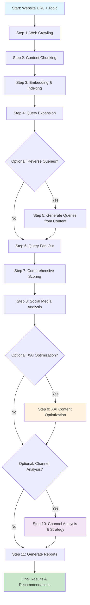

# Zero-Click Compass 🧭

**AI-Powered Content Optimization & Channel Strategy Platform** - Optimize your content for the AI-driven, personalized internet of the future.

## What & Why

In the AI era, content needs to rank **inside** LLM responses and meet users where they are across multiple platforms. Zero-Click Compass provides comprehensive analysis and optimization for the personalized internet.

### Key Capabilities

- **🔍 Reverse Query Generation**: Discover what queries your content actually answers
- **🌊 Query Fan-Out**: Expand queries using Google AI Mode methodology
- **🧠 XAI Content Optimization**: AI-powered content gap analysis and optimization
- **📱 Channel Strategy**: Identify where users ask queries and recommend engagement strategies
- **🎯 Comprehensive Scoring**: Score content against expanded query sets
- **🤖 Agentic Foundation**: Bottom-up pyramid approach for future AI agent engagement

## 🏗️ Complete System Architecture

```
┌─────────────────────────────────────────────────────────────────────────────┐
│                        ZERO-CLICK COMPASS ECOSYSTEM                        │
├─────────────────────────────────────────────────────────────────────────────┤
│                                                                             │
│  ┌─────────────────┐    ┌─────────────────┐    ┌─────────────────┐        │
│  │   CONTENT       │    │   QUERY         │    │   ANALYSIS      │        │
│  │   PIPELINE      │    │   EXPANSION     │    │   & OPTIMIZATION│        │
│  │                 │    │                 │    │                 │        │
│  │ • Web Crawling  │    │ • Reverse Query │    │ • XAI Content   │        │
│  │ • Chunking      │    │   Generation    │    │   Optimization  │        │
│  │ • Embedding     │    │ • Query Fan-Out │    │ • Channel       │        │
│  │ • Indexing      │    │ • Intent Trees  │    │   Analysis      │        │
│  └─────────────────┘    └─────────────────┘    └─────────────────┘        │
│           │                       │                       │                │
│           └───────────────────────┼───────────────────────┘                │
│                                   │                                        │
│  ┌─────────────────────────────────┼─────────────────────────────────────┐  │
│  │                    COMPREHENSIVE SCORING ENGINE                      │  │
│  │                                                                       │  │
│  │ • Matrix Scoring (Content × Queries)                                 │  │
│  │ • Composite Relevance (70% Semantic + 30% Token)                     │  │
│  │ • Gap Analysis & Recommendations                                     │  │
│  │ • Performance Rankings & Reports                                     │  │
│  └───────────────────────────────────────────────────────────────────────┘  │
│                                   │                                        │
│  ┌─────────────────────────────────┼─────────────────────────────────────┐  │
│  │                    STRATEGY & ENGAGEMENT LAYER                       │  │
│  │                                                                       │  │
│  │ • Platform-Specific Strategies (Reddit, X, Google, Yelp, Quora)      │  │
│  │ • Content Adaptation Guidelines                                      │  │
│  │ • Implementation Roadmaps                                            │  │
│  │ • Future Agentic Engagement Foundation                               │  │
│  └───────────────────────────────────────────────────────────────────────┘  │
└─────────────────────────────────────────────────────────────────────────────┘
```

## 🔄 Complete Workflow Flowchart



## 🚀 Quick Start

### 1. Installation
```bash
# Clone repository
git clone <repository-url>
cd zero-click-compass

# Create environment
conda create -n zero-click python=3.9
conda activate zero-click

# Install dependencies
pip install -r requirements.txt
```

### 2. Environment Setup
```bash
# Copy environment template
cp env.template .env

# Edit .env with your API keys
GOOGLE_API_KEY=your_gemini_api_key
REDDIT_CLIENT_ID=your_reddit_client_id
REDDIT_CLIENT_SECRET=your_reddit_secret
TWITTER_BEARER_TOKEN=your_twitter_token
```

### 3. Run Complete Pipeline
```bash
# Full pipeline with all features
python -m src.cli pipeline https://your-site.com "your topic" \
  --reverse-queries \
  --fanout-queries "content marketing" "SEO strategies" \
  --fanout-mode "AI Mode (complex)" \
  --comprehensive-scoring \
  --xai-optimize \
  --channel-analyze
```

### 4. Run Dashboard
```bash
streamlit run app.py
```

## 📋 Available Commands

### Individual Commands
```bash
# Content Pipeline
python -m src.cli crawl https://example.com --max-pages 50
python -m src.cli chunk
python -m src.cli embed

# Query Analysis
python -m src.cli reverse --analyze --target-queries "marketing tips" "SEO guide"
python -m src.cli fanout --queries "content marketing" "SEO strategies" --mode "AI Mode (complex)" --analyze

# Scoring & Analysis
python -m src.cli comprehensive --top-k 15
python -m src.cli xai-optimize --analyze --target-queries "best mattress" "sleep quality"
python -m src.cli channel-analyze --generate-strategy

# Social Media
python -m src.cli social "SEO best practices" --analyze
```

### Pipeline Options
```bash
# Basic pipeline
python -m src.cli pipeline https://example.com "marketing strategies"

# With reverse queries
python -m src.cli pipeline https://example.com "marketing strategies" --reverse-queries

# With query fan-out
python -m src.cli pipeline https://example.com "marketing strategies" \
  --fanout-queries "content marketing" "SEO strategies" \
  --fanout-mode "AI Mode (complex)"

# With comprehensive scoring
python -m src.cli pipeline https://example.com "marketing strategies" \
  --comprehensive-scoring

# With XAI optimization
python -m src.cli pipeline https://example.com "marketing strategies" \
  --xai-optimize

# With channel analysis
python -m src.cli pipeline https://example.com "marketing strategies" \
  --channel-analyze

# Complete pipeline with all features
python -m src.cli pipeline https://example.com "marketing strategies" \
  --reverse-queries \
  --fanout-queries "content marketing" "SEO strategies" \
  --fanout-mode "AI Mode (complex)" \
  --comprehensive-scoring \
  --xai-optimize \
  --channel-analyze
```

## 📊 Output Files

### Core Pipeline Outputs
- `data/chunks.jsonl` - Semantic content chunks
- `data/faiss_index.faiss` - Vector search index
- `data/visibility.csv` - Content performance rankings

### Query Analysis Outputs
- `data/generated_queries.jsonl` - Reverse-generated queries
- `data/query_fanout.jsonl` - Expanded fan-out queries
- `data/comprehensive_top_results.csv` - Top scoring content
- `data/comprehensive_all_scores.csv` - All chunk-query scores

### Optimization Outputs
- `data/xai_optimization.jsonl` - XAI content optimization analysis
- `data/channel_analysis.jsonl` - Channel distribution analysis
- `data/channel_analysis_strategy.json` - Comprehensive engagement strategy

### Social Media Outputs
- `data/channels.json` - Social media influencer analysis
- `data/social_impact.json` - Social media impact metrics

## 🧠 XAI Content Optimization

The XAI system provides 5-part analysis for each content piece:

1. **Content Coverage Analysis**: What aspects are well-covered
2. **Content Gap Analysis**: What's missing or underdeveloped
3. **AI Visibility Optimization**: How to answer more sub-queries
4. **Query Expansion Opportunities**: Related queries to address
5. **Content Structure Recommendations**: How to reorganize for better AI comprehension

### Example XAI Output
```
=== XAI Optimization Results ===
Chunks optimized: 25
Queries analyzed: 150

Top Content Gaps:
  • Common pattern: missing (mentioned in 18/25 chunks)
  • Common pattern: expand (mentioned in 15/25 chunks)
  • Common pattern: improve (mentioned in 12/25 chunks)
```

## 📱 Channel Strategy & Engagement

The channel analysis system identifies where users ask specific queries and provides platform-specific strategies:

### Supported Platforms
- **Reddit**: Community participation, detailed posts and comments
- **X/Twitter**: Conversation participation, threads and replies
- **Google**: SEO optimization, comprehensive articles
- **Yelp**: Review responses, professional engagement
- **Quora**: Expert answers, detailed responses
- **LinkedIn**: Professional networking, industry insights

### Example Channel Strategy Output
```
=== Channel Strategy ===
Total queries analyzed: 150

Channel Distribution:
  REDDIT: 45 queries
  TWITTER: 38 queries
  GOOGLE: 32 queries
  QUORA: 25 queries

Top Implementation Priorities:
  1. REDDIT (Score: 45, Focus: high)
  2. TWITTER (Score: 38, Focus: high)
  3. GOOGLE (Score: 32, Focus: medium)
```

## 🏗️ SOLID Architecture

The system follows SOLID principles throughout:

- **Single Responsibility**: Each class has one job
- **Open/Closed**: Extensible without modification
- **Liskov Substitution**: Interfaces are interchangeable
- **Interface Segregation**: Small, focused interfaces
- **Dependency Inversion**: Depend on abstractions, not concretions

### Core Modules
```
src/
├── crawl.py              # Web scraping with Selenium
├── chunk.py              # Semantic chunking with tiktoken
├── embed.py              # Gemini embeddings + FAISS indexing
├── expand.py             # Query expansion & intent trees
├── score.py              # Multi-method relevance scoring
├── channels.py           # Social media analysis
├── query_generator.py    # Reverse query generation
├── query_fanout.py       # Query fan-out expansion
├── comprehensive_scorer.py # Comprehensive content scoring
├── xai_optimizer.py      # XAI content optimization
├── channel_analyzer.py   # Channel analysis & strategy
└── cli.py                # Pipeline orchestration
```

## 🎯 Use Cases

### 1. Content Audit & Optimization
- Discover what queries your content actually answers
- Identify content gaps and optimization opportunities
- Optimize for AI visibility and comprehension

### 2. Channel Strategy Development
- Understand where your target audience asks questions
- Develop platform-specific engagement strategies
- Plan content adaptation for different channels

### 3. Competitive Analysis
- Analyze competitor content performance
- Identify market gaps and opportunities
- Benchmark against industry standards

### 4. SEO & AI Optimization
- Optimize for both traditional SEO and AI-driven search
- Improve content structure for better AI comprehension
- Enhance query coverage and relevance

### 5. Future-Proofing
- Prepare for agentic engagement with AI agents
- Build foundation for personalized internet interactions
- Develop automated response and engagement systems

## 🔮 Future Agentic Engagement

The system provides a bottom-up pyramid approach for future AI agent engagement:

### Layer 1: Analysis Foundation
- Content optimization analysis
- Channel distribution analysis
- Query-user behavior mapping

### Layer 2: Strategy Generation
- Platform-specific strategies
- Content adaptation guidelines
- Engagement tactics

### Layer 3: Implementation Planning
- Priority-based implementation
- Resource allocation
- Timeline planning

### Layer 4: Future Agentic Engagement (Ready for Implementation)
- Automated response systems
- AI agent engagement
- Personalized user interactions

## 🧪 Testing

```bash
# Run all tests
python run_tests.py

# Run specific test modules
python -m pytest tests/test_crawl.py
python -m pytest tests/test_optimization.py
```

## 📈 Performance Metrics

The system provides comprehensive performance metrics:

- **Content Coverage**: Percentage of target queries answered
- **AI Visibility Score**: How well content is optimized for AI comprehension
- **Channel Distribution**: Where users ask relevant queries
- **Engagement Potential**: Platform-specific engagement opportunities
- **Optimization Priority**: Prioritized improvement recommendations

## 🤝 Contributing

1. Fork the repository
2. Create a feature branch
3. Make your changes
4. Add tests
5. Submit a pull request

## 📄 License

MIT License - see LICENSE file for details.

## 🆘 Support

For issues and questions:
- Create an issue on GitHub
- Check the documentation
- Review the examples in the `examples/` directory

---

**Zero-Click Compass** - Optimizing content for the AI-driven, personalized internet of the future! 🚀 