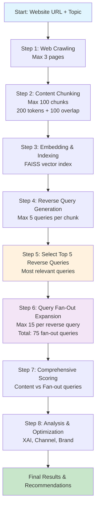

# Zero-Click Compass 🧭

**Sequential Content-to-Query Analysis Platform** - Optimize your content for the AI-driven, personalized internet of the future.

## What & Why

In the AI era, content needs to rank **inside** LLM responses and meet users where they are across multiple platforms. Zero-Click Compass provides a **sequential content-to-query analysis pipeline** that works backwards from your content to discover what queries it answers, then expands those queries for comprehensive optimization.

### Key Capabilities

- **🔄 Content-to-Query Generation**: Discover what queries your content actually answers
- **🌊 Query Fan-Out Expansion**: Expand reverse queries using AI methodology (max 15 per query)
- **🧠 XAI Content Optimization**: AI-powered content gap analysis and optimization
- **📱 Channel Strategy**: Identify where users ask queries and recommend engagement strategies
- **🎯 Comprehensive Scoring**: Score content against expanded query sets
- **🏢 Brand Curation**: Industry-specific content strategy and optimization
- **🤖 Agentic Foundation**: Bottom-up pyramid approach for future AI agent engagement

## 🏗️ Sequential System Architecture

```
┌─────────────────────────────────────────────────────────────────────────────┐
│                    ZERO-CLICK COMPASS SEQUENTIAL PIPELINE                   │
├─────────────────────────────────────────────────────────────────────────────┤
│                                                                             │
│  ┌─────────────────┐    ┌─────────────────┐    ┌─────────────────┐        │
│  │   CONTENT       │    │   QUERY         │    │   ANALYSIS      │        │
│  │   PIPELINE      │    │   EXPANSION     │    │   & OPTIMIZATION│        │
│  │   (Step 1-3)    │    │   (Step 4-5)    │    │   (Step 6+)     │        │
│  │                 │    │                 │    │                 │        │
│  │ • Web Crawling  │    │ • Reverse Query │    │ • XAI Content   │        │
│  │   (max 3 pages) │    │   Generation    │    │   Optimization  │        │
│  │ • Chunking      │    │   (max 5 per    │    │ • Channel       │        │
│  │   (max 100)     │    │    chunk)       │    │   Analysis      │        │
│  │ • Embedding     │    │ • Query Fan-Out │    │ • Brand         │        │
│  │ • Indexing      │    │   (max 15 per   │    │   Curation      │        │
│  └─────────────────┘    │    query)       │    └─────────────────┘        │
│           │             └─────────────────┘                 │                │
│           └───────────────────────┼─────────────────────────┘                │
│                                   │                                        │
│  ┌─────────────────────────────────┼─────────────────────────────────────┐  │
│  │                    COMPREHENSIVE SCORING ENGINE                      │  │
│  │                                                                       │  │
│  │ • Matrix Scoring (Content × Fan-out Queries)                         │  │
│  │ • Composite Relevance (70% Semantic + 30% Token)                     │  │
│  │ • Gap Analysis & Recommendations                                     │  │
│  │ • Performance Rankings & Reports                                     │  │
│  └───────────────────────────────────────────────────────────────────────┘  │
│                                   │                                        │
│  ┌─────────────────────────────────┼─────────────────────────────────────┐  │
│  │                    STRATEGY & ENGAGEMENT LAYER                       │  │
│  │                                                                       │  │
│  │ • Platform-Specific Strategies (Reddit, X, Google, Yelp, Quora)      │  │
│  │ • Industry-Specific Brand Curation                                   │  │
│  │ • Content Adaptation Guidelines                                      │  │
│  │ • Implementation Roadmaps                                            │  │
│  │ • Future Agentic Engagement Foundation                               │  │
│  └───────────────────────────────────────────────────────────────────────┘  │
└─────────────────────────────────────────────────────────────────────────────┘
```

## 🔄 Sequential Workflow Flowchart



## 🚀 Quick Start

### 1. Installation
```bash
# Clone repository
git clone <repository-url>
cd zero-click-compass

# Create environment
conda create -n MLHW python=3.9
conda activate MLHW

# Install dependencies
pip install -r requirements.txt
```

### 2. Environment Setup
```bash
# Create .env file
cp .env.example .env

# Add your Google Gemini API key
echo "GOOGLE_API_KEY=your_api_key_here" >> .env
```

### 3. Run Sequential Pipeline

#### Streamlit Interface (Recommended)
```bash
streamlit run app.py
```
Navigate to `http://localhost:8501` and use the **Complete Sequential Pipeline** tab.

#### Command Line Interface
```bash
# Basic sequential pipeline
python -m src.cli pipeline https://example.com "your topic"

# With custom limits
python -m src.cli pipeline https://example.com "your topic" \
  --max-pages 3 \
  --max-chunks 100 \
  --chunk-size 200 \
  --sliding-window 100 \
  --max-reverse-queries 5 \
  --max-fanout-per-query 15
```

## 📊 Sequential Pipeline Configuration

### Default Limits (Optimized for Performance)
- **Max Pages**: 3 pages
- **Max Chunks**: 100 chunks
- **Chunk Size**: 200 tokens
- **Sliding Window**: 100 tokens overlap
- **Reverse Queries**: 5 per chunk
- **Fan-out Queries**: 15 per reverse query
- **Total Fan-out**: Up to 75 queries (5 × 15)

### Pipeline Steps

#### **Step 1-3: Content Pipeline**
1. **Web Crawling**: Crawl up to 3 pages from your website
2. **Content Chunking**: Split content into max 100 semantic chunks
3. **Embedding & Indexing**: Create FAISS vector index for similarity search

#### **Step 4-5: Query Expansion**
4. **Reverse Query Generation**: Generate up to 5 queries per content chunk
5. **Query Fan-Out**: Expand top 5 reverse queries (15 each = 75 total)

#### **Step 6+: Analysis & Optimization**
6. **Comprehensive Scoring**: Score content against 75 fan-out queries
7. **XAI Optimization**: AI-powered content gap analysis
8. **Channel Analysis**: Platform-specific engagement strategies
9. **Brand Curation**: Industry-specific recommendations

## 🏢 Brand Curation Features

### Industry-Specific Strategies
- **B2B SaaS**: ROI-driven content, technical depth, thought leadership
- **E-commerce**: Visual content, product guides, shopping optimization
- **Healthcare**: Educational content, patient resources, compliance
- **Finance**: Data-driven insights, regulatory compliance, trust-building
- **Education**: Learning outcomes, interactive content, student success

### Brand Stage Optimization
- **Startup**: Brand awareness, market validation, problem-solution content
- **Growth**: Lead generation, case studies, customer success stories
- **Established**: Thought leadership, industry reports, market dominance
- **Enterprise**: Innovation insights, executive thought leadership

### Channel-Specific Tactics
- **LinkedIn**: Professional insights, industry analysis, B2B networking
- **Google**: SEO optimization, comprehensive guides, featured snippets
- **Reddit**: Community discussions, authentic engagement, problem-solving
- **Quora**: Expert positioning, detailed explanations, authority building

## 🛠️ Available Commands

### Core Pipeline Commands
```bash
# Complete sequential pipeline
python -m src.cli pipeline <url> <query>

# Individual steps
python -m src.cli crawl <url> --max-pages 3
python -m src.cli chunk --max-chunks 100
python -m src.cli embed
```

### Analysis Commands
```bash
# Reverse query generation
python -m src.cli reverse --analyze

# Query fan-out expansion
python -m src.cli fanout --queries "query1" "query2" --mode "AI Overview (simple)"

# Comprehensive scoring
python -m src.cli comprehensive --top-k 15

# XAI content optimization
python -m src.cli xai-optimize --analyze

# Channel analysis
python -m src.cli channel-analyze --generate-strategy
```

### Search & Analysis
```bash
# Search existing index
python -m src.cli search "your query"

# Social media analysis
python -m src.cli social "your topic" --analyze

# Query expansion
python -m src.cli expand "your query" --max-expansions 15
```

## 📈 Output Files

### Core Pipeline Outputs
- `data/crawled_pages.jsonl`: Raw crawled content
- `data/chunks.jsonl`: Semantic content chunks
- `data/faiss_index.faiss`: Vector similarity index
- `data/reverse_queries.jsonl`: Generated reverse queries
- `data/query_fanout.jsonl`: Fan-out expanded queries

### Analysis Outputs
- `data/comprehensive_scores.jsonl`: Content-query scoring matrix
- `data/xai_optimization.jsonl`: XAI optimization recommendations
- `data/channel_analysis.jsonl`: Channel strategy analysis
- `visibility.csv`: Content visibility report
- `channels.json`: Platform-specific engagement data

## 🎯 Use Cases & Examples

### Content Audit
```bash
# Analyze existing content coverage
python -m src.cli pipeline https://your-site.com "content marketing" \
  --max-pages 3 --max-chunks 100
```

### Competitive Analysis
```bash
# Analyze competitor content strategy
python -m src.cli pipeline https://competitor.com "SEO strategies" \
  --max-pages 3 --max-chunks 100
```

### Brand Optimization
```bash
# Industry-specific brand analysis
python -m src.cli pipeline https://your-brand.com "B2B SaaS marketing" \
  --max-pages 3 --max-chunks 100
```

### Channel Strategy
```bash
# Platform-specific engagement analysis
python -m src.cli channel-analyze --generate-strategy
```

## 🔧 Configuration Options

### Streamlit Interface
- **Sequential Pipeline Settings**: All limits configurable via sliders
- **Brand Curation**: Industry, stage, audience, goals selection
- **Analysis Options**: Toggle different analysis types
- **Real-time Progress**: Step-by-step progress tracking

### CLI Configuration
```bash
# Pipeline limits
--max-pages 3              # Maximum pages to crawl
--max-chunks 100           # Maximum content chunks
--chunk-size 200           # Chunk size in tokens
--sliding-window 100       # Overlap between chunks

# Query generation limits
--max-reverse-queries 5    # Reverse queries per chunk
--max-fanout-per-query 15  # Fan-out queries per reverse query

# Analysis options
--comprehensive-scoring    # Run comprehensive scoring
--xai-optimize            # Run XAI optimization
--channel-analyze         # Run channel analysis
```

## 🏗️ Architecture Principles

### SOLID Design
- **Single Responsibility**: Each module has one clear purpose
- **Open/Closed**: Extensible without modification
- **Liskov Substitution**: Interchangeable implementations
- **Interface Segregation**: Focused, specific interfaces
- **Dependency Inversion**: High-level modules independent of low-level details

### Sequential Processing
- **Content-First**: All analysis starts with content chunks
- **Query-Driven**: Reverse queries drive fan-out expansion
- **Linear Flow**: Each step depends on previous step completion
- **Controlled Scale**: Configurable limits prevent resource overload

### Future-Ready
- **Agentic Foundation**: Bottom-up pyramid for AI agent engagement
- **Modular Design**: Easy to add new analysis types
- **API-Ready**: Structured for future API deployment
- **Scalable**: Designed for enterprise-scale deployment

## 🤝 Contributing

1. Fork the repository
2. Create a feature branch
3. Follow SOLID principles
4. Add tests for new functionality
5. Submit a pull request

## 📄 License

MIT License - see LICENSE file for details

## 🆘 Support

- **Documentation**: See `BRAND_CURATION_GUIDE.md` for detailed usage
- **Issues**: Report bugs and feature requests via GitHub Issues
- **Discussions**: Join community discussions for best practices

---

**Zero-Click Compass** - Optimizing content for the AI-driven, personalized internet of the future! 🚀 